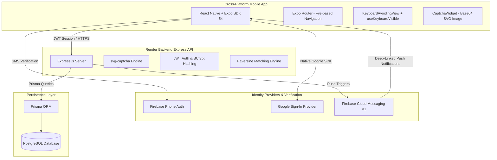

# FindMyThing: Technical Project Reference Guide

This document serves as a comprehensive, production-grade guide for your resume, portfolio, and interview preparation. It covers the system architecture, technology stack, engineering decisions, security practices, and troubleshooting lessons from developing **FindMyThing**.

---

## 1. Project Overview & Pitch

**FindMyThing** is a security-hardened, real-time cross-platform Lost & Found mobile application. It connects **Founders** (people who find lost items) with **Victims** (people searching for their belongings) through an automated matching engine and a multi-tiered verification pipeline. 

### The Problem It Solves
Traditional lost-and-found systems (like physical bulletin boards or open social media posts) are inefficient and highly vulnerable to **fraudulent claims**, spam, and bot activity. If a finder posts a photo of a lost wallet online, scammers can easily describe it to claim it.

### The FindMyThing Solution
1. **Automated Geolocation Matching**: Uses a mathematical matching algorithm (Haversine formula + fuzzy string matching) to instantly link lost item complaints with reported found items.
2. **Multi-Tiered Security claims**: Victims must complete a secure challenge-response pipeline to reveal a founder's contact info:
   - **Math CAPTCHA** (Service-oriented; stops bot abuse).
   - **SMS OTP Verification** (Ensures claims are linked to a verified physical device).
   - **Owner Cryptographic Security Questions** (Only the real owner knows the answers to custom questions set by the finder; the item photo remains hidden until these are answered).

---

## 2. System Architecture & Tech Stack



### Frontend Technology Stack
* **Framework**: React Native + Expo (SDK 54)
* **Routing & Navigation**: Expo Router (File-based routing with deep-linking support)
* **Styling**: Vanilla CSS stylesheets optimized for hardware acceleration
* **Icons & UI Assets**: Lucide React Native & Expo Image (High-performance caching and out-of-the-box SVG rendering)
* **State Management**: React Context API (`AuthContext`, `ThemeContext`) for low-overhead global state

### Backend Technology Stack
* **Runtime**: Node.js & TypeScript
* **Web Framework**: Express.js
* **Database ORM**: Prisma Client
* **Database**: PostgreSQL (hosted on Render / Supabase)
* **Security & Auth**: Custom JSON Web Token (JWT) system combined with bcryptjs password hashing and Google OAuth 2.0 verification library (`google-auth-library`)

---

## 3. Core Engineering Implementations

### A. Geolocation & Text Matching Engine
When a victim files a complaint, a backend trigger searches the database for potential matches using:
1. **Fuzzy String Search**: Compares category tags and text similarity.
2. **Haversine Distance Formula**: Computes exact geographical distance between the coordinates of where the item was lost vs. where it was found.
3. **Automated Notification Dispatch**: Instantly triggers a push notification payload if the item is within a specified radius (e.g., 5km) and the categories match.

### B. Service-Oriented CAPTCHA Verification
Unlike insecure frontend-only CAPTCHAs, FindMyThing implements a cryptographically secure, service-oriented CAPTCHA flow:
1. **Client** requests a challenge from `/api/captcha/generate`.
2. **Backend** uses `svg-captcha` to generate a random math expression, registers it in an **in-memory server store** with a unique ID and a 5-minute expiry timestamp, and returns a high-performance **base64 SVG data URI** + `captchaId` to the client.
3. **Client** displays the SVG dynamically using `expo-image` and prompts the user for the answer.
4. **Backend** validates the submitted answer via `/api/captcha/verify` and purges the CAPTCHA immediately (preventing replay attacks).

### C. Deep-Linked Notifications
Instead of just launching the app's home screen, clicking a push notification takes the user directly to the claim page of the matching item:
* **Backend** injects a payload: `{ url: "/victim/verify-notification?payload=..." }`.
* **Frontend** uses `expo-notifications` event listener in `_layout.tsx` to read the incoming navigation URL and trigger `router.push()` to route the user instantly.

---

## 4. Key Engineering Challenges & Lessons Learned

### Lesson 1: Secure Secrets Management & Git Sanitization
* **The Mistake**: Accidentally added sensitive credentials (`credentials.json`, private keys) to Git, which got blocked by GitHub's Push Protection rules.
* **The Fix**: Successfully purged the commit history safely:
  ```bash
  # Remove file from index (tracking) without deleting local copy
  git rm --cached credentials.json
  # Commit the changes and amend the previous broken commit
  git commit --amend --no-edit
  # Push sanitized branch safely
  git push --force-with-lease
  ```
  Updated `.gitignore` to explicitly prevent leaks of development assets.
* **Key Takeaway**: Always whitelist files via `.gitignore` before committing, and use secure env variables or runtime parameter stores in cloud hosting environments.

### Lesson 2: Android Modal keyboard Avoidance & Flickering
* **The Mistake**: The OTP validation popup input fields were covered by the software keyboard on Android. Wrapping the modal in standard `KeyboardAvoidingView` caused aggressive layout flickering.
* **The Diagnosis**: On Android, the Modal's `animationType="slide"` conflicted with `KeyboardAvoidingView` trying to translate the modal card upward simultaneously.
* **The Fix**:
  1. Placed the `KeyboardAvoidingView` as the **direct child of the `<Modal>`** component (crucial for React Native event propagation).
  2. Changed `animationType` from `"slide"` to `"fade"` to remove animation timeline overlap.
  3. Forced `behavior="padding"` on both iOS and Android for stable position offsets.
  ```tsx
  <Modal visible={visible} animationType="fade" transparent statusBarTranslucent>
      <KeyboardAvoidingView behavior="padding" style={{ flex: 1 }}>
          <View style={styles.overlay}>
              {/* Modal Card Content */}
          </View>
      </KeyboardAvoidingView>
  </Modal>
  ```

### Lesson 3: Responsive Interface Under Soft Keyboard
* **The Mistake**: On small screens, opening the keyboard to fill input fields on Login/Signup clipped the header title and cut off input forms.
* **The Fix**: Created a custom hook `useKeyboardVisible` utilizing React Native's Native Keyboard Listeners (`keyboardDidShow` / `keyboardDidHide`). 
* **The Result**: Used the hook state to conditionally hide the branding header and titles when typing, saving over **120px** of vertical screen real estate for forms.

---

## 5. Important Command-Line Commands for Your Toolbelt

Save these for your interviews to demonstrate hands-on development expertise:

### A. React Native & Expo Development
```bash
# Start local Metro bundler with Dev Client support
npx expo start --dev-client

# Trigger native Android builds (compiles Gradle and launches emulator)
npx expo run:android

# Generate production-ready static web bundle
npx expo export -p web
```

### B. EAS (Expo Application Services) Native Builds
```bash
# Build development client for Android devices
eas build --profile development --platform android

# Submit built package to Google Play Store / Apple App Store
eas submit --platform android
```

### C. Database & ORM (Prisma)
```bash
# Generate Prisma Client types after schema updates
npx prisma generate

# Apply local schema changes to database (Migration)
npx prisma migrate dev --name init

# Launch interactive Prisma Studio GUI to inspect DB tables
npx prisma studio
```

---

## 6. Resume Bullet Points (Copy & Paste Ready)

* **Cross-Platform Mobile Developer | React Native, Express, PostgreSQL**
  * Developed and deployed **FindMyThing**, a secure cross-platform lost & found mobile application using **React Native (Expo SDK 54)** and a **TypeScript/Express** REST API backend.
  * Designed and built a **multi-tiered claim verification pipeline** containing secure service-oriented math **CAPTCHAs**, **Firebase SMS OTP verification**, and user-defined challenge-response questions to completely eliminate fraudulent claiming.
  * Engineered a high-performance **automated matching engine** utilizing the **Haversine formula** for geographical distance filtering paired with fuzzy string matching of item characteristics.
  * Configured **Expo Push Notification services (FCM V1)**, implementing custom routing payloads to support seamless deep-linking to redirect users straight to matching items upon notification click.
  * Resolved critical layout issues on Android by mastering React Native Native Event listeners, optimizing modal viewport alignments under keyboard popups, and eliminating layout flickering through custom hardware-accelerated animations.
  * Managed backend schema migrations and high-performance querying using **Prisma ORM** coupled with a robust **PostgreSQL** database.
